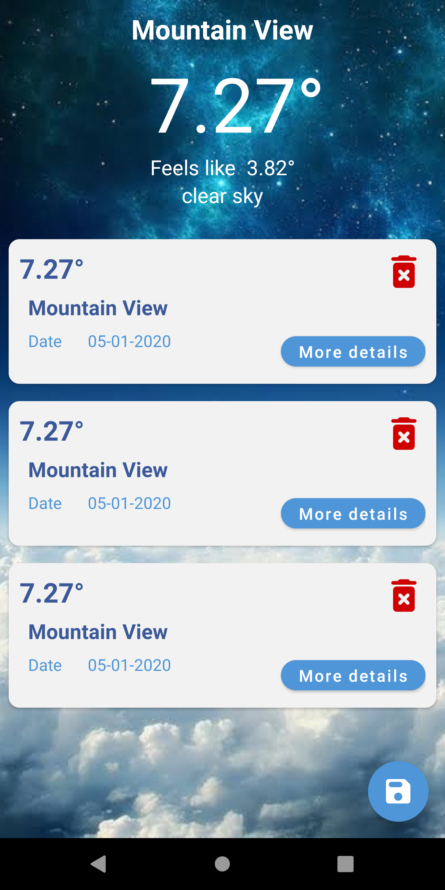
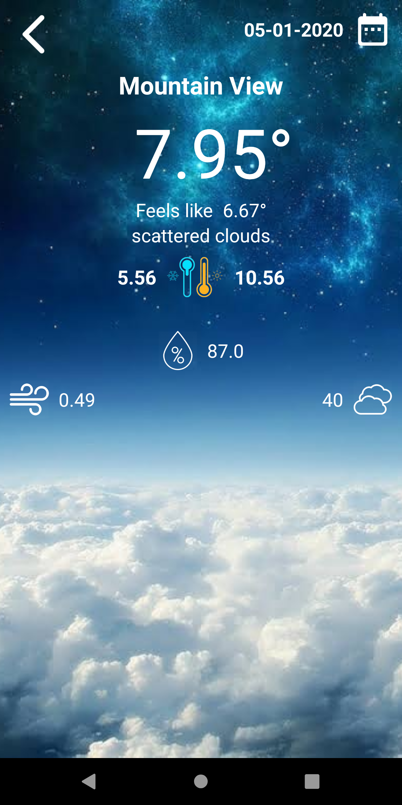

# weather-logger
The app caches weather conditions for your current location.

## Demo

  
  
  

## Tech Stack
- **Kotlin**
- **MVVM**
- **Dagger**
- **Retrofit**
- **RxJava**
- **Widget**
- **JUnit5**
- **Mockito**
- **Navigation Component**
