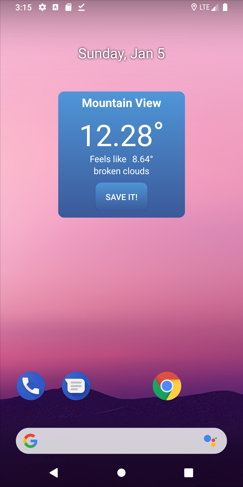

# weather-logger
The app caches weather conditions for your current location.

## Demo

  
  
  

###### Features
- [x] Compatibility with Android 4.1 and higher
- [x] Optimized on both modes: portrait and landscape
- [x] The whole app is implemented in Kotlin
- [x] Refresh the weather data periodically every 1 min
- [x] Includes 2 screens (Home, Details)
- [x] Custom transitions between screens
- [x] Local storage (create, read and delete operations)
- [x] Widget for Home Screen

## Tech Stack
- **Kotlin**
- **MVVM**
- **Dagger**
- **Retrofit**
- **RxJava**
- **Widget**
- **Room**
- **JUnit5**
- **Mockito**
- **Navigation Component**
